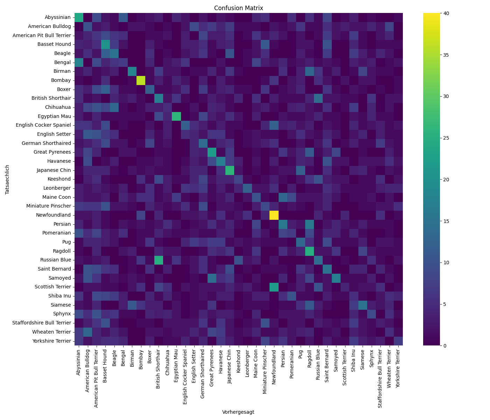

# Ergebnisse: CNN Hyperparameter Optimization (Oxford-IIIT Pet)

## Dataset

Oxford-IIIT Pet Datensatz, 37 Klassen (Katzen- und Hunderassen), geladen ueber
`torchvision.datasets.OxfordIIITPet`. trainval-Split 80/20 in train/val
(seed=42), offizieller test-Split unveraendert.

**TODO:** kurze Zusammenfassung der EDA-Ergebnisse hier einfuegen
(siehe eda_class_distribution.png, eda_image_sizes.png, eda_sample_images.png).

## Preprocessing und Augmentation

Resize + Normalisierung (ImageNet mean/std). Augmentation (nur Training):
RandomHorizontalFlip.

## Hyperparameter-Suche (Optuna)

Top Trials nach Validation-Accuracy:

|   val_accuracy | augmentation   |   base_channels |   batch_size |   dropout_rate |   learning_rate |   num_layers | pooling_type   |
|---------------:|:---------------|----------------:|-------------:|---------------:|----------------:|-------------:|:---------------|
|       0.125    | False          |              16 |           32 |            0   |     0.00167261  |            2 | max            |
|       0.120924 | False          |              16 |           32 |            0   |     0.000979785 |            2 | max            |
|       0.112772 | False          |              16 |           32 |            0.3 |     0.000458214 |            4 | max            |
|       0.111413 | False          |              16 |           32 |            0.2 |     0.000617069 |            4 | max            |
|       0.108696 | False          |              16 |           16 |            0.3 |     0.000984895 |            3 | max            |
|       0.108696 | True           |              16 |           32 |            0   |     0.00160392  |            2 | avg            |
|       0.105978 | False          |              16 |           32 |            0   |     0.000558129 |            2 | max            |
|       0.105978 | False          |              16 |           32 |            0   |     0.00126854  |            3 | max            |
|       0.103261 | False          |              16 |           32 |            0   |     0.000518307 |            2 | max            |
|       0.103261 | True           |              64 |           16 |            0.5 |     0.000257475 |            3 | avg            |

Beste gefundene Konfiguration:

```json
{
  "learning_rate": 0.0016726081030450782,
  "batch_size": 32,
  "dropout_rate": 0.0,
  "pooling_type": "max",
  "num_layers": 2,
  "base_channels": 16,
  "augmentation": false,
  "channels": [
    16,
    32
  ],
  "val_accuracy": 0.125
}
```

**TODO:** kurze Diskussion, welcher Parameter den groessten Einfluss hatte.

## Finale Evaluation

Trainingseinstellungen:

```json
{
  "epochs": 15,
  "learning_rate": 0.0016726081030450782,
  "batch_size": 32,
  "dropout_rate": 0.0,
  "pooling_type": "max",
  "channels": [
    16,
    32
  ],
  "augmentation": false,
  "seed": 42
}
```

| Metrik | Wert |
|---|---|
| Accuracy | 0.1431 |
| Precision (macro) | 0.1506 |
| Recall (macro) | 0.1437 |

Confusion Matrix:



Haeufigste Verwechslungen:

| true_class        | predicted_class   |   count |
|:------------------|:------------------|--------:|
| Russian Blue      | British Shorthair |      25 |
| Scottish Terrier  | Newfoundland      |      22 |
| Bengal            | Abyssinian        |      18 |
| Persian           | Ragdoll           |      16 |
| British Shorthair | Russian Blue      |      14 |
| Samoyed           | Great Pyrenees    |      14 |
| Maine Coon        | Persian           |      13 |
| Chihuahua         | Beagle            |      13 |
| Wheaten Terrier   | American Bulldog  |      13 |
| Birman            | Ragdoll           |      13 |

**TODO:** kurze Interpretation der haeufigsten Verwechslungen.

## Reproducibility

Seed 42 fuer random/numpy/torch (inkl. CUDA), cudnn.deterministic=True
(siehe seed.py). Alle Trainingseinstellungen des finalen Laufs sind oben
dokumentiert und zusaetzlich in final_training_settings.json gespeichert.
Modellgewichte: best_model.pt
